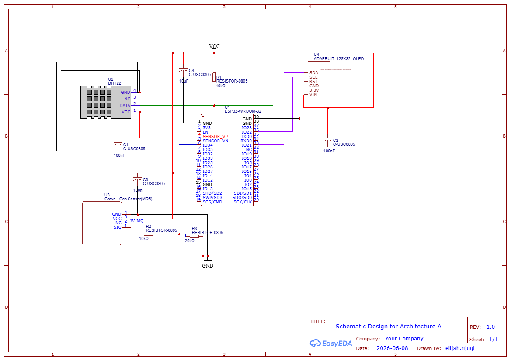
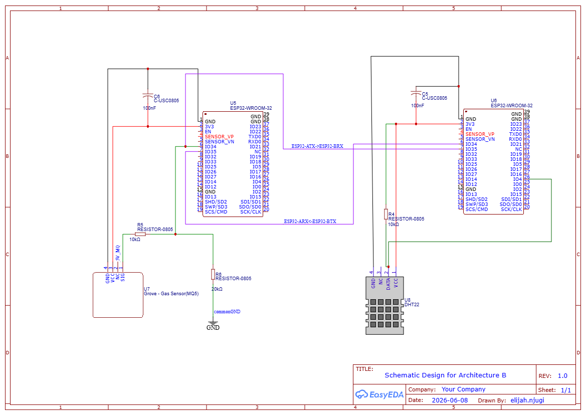
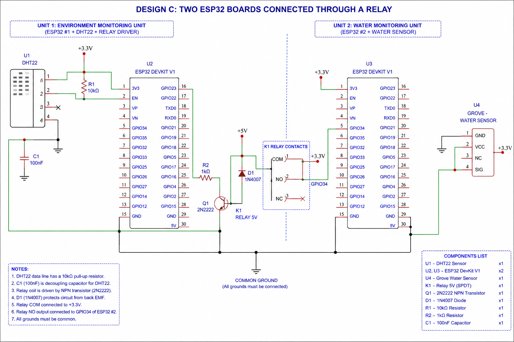

# Semester Project Deliverable 1
## Flora Farms Greenhouse Monitoring System

### Group Members
| Name | Registration Number |
|--------|--------|
| NJUGI ELIJAH | 146412 |
| KANYI SHARON WAMBUI | 153486 |
| MWANGI BILLIART B. MUTHONI | 164099 |
| MACHARIA GRACE WAIRIMU | 165899 |
| SAMSON AIRA | 166456 |
| KEVIN RENANA | 168377 |

---

# Project Overview

Flora Farms is a flower farm located in Naivasha, Kenya. The objective of this project is to design an IoT-based greenhouse monitoring system capable of monitoring environmental conditions that affect flower growth. The system will utilize sensors, ESP32 microcontrollers, wireless communication, and cloud technologies to support precision agriculture.

The assigned flower for this group is **Daisy**.

---

# Task 1: Daisy Environmental Requirements

The following table summarizes the optimal growing conditions for daisies.

| Parameter | Optimal Range |
|------------|------------------|
| Temperature | 15°C–22°C (ideal); tolerates 10°C–26°C |
| Relative Humidity | 50%–70% |
| Soil Type | Well-draining loamy or sandy loam soil |
| Soil Moisture | 40%–60% volumetric water content |
| Soil pH | 6.0 – 7.0 |
| Sunlight Exposure | 6 – 8 hours per day |

## Explanation

### Temperature
Daisies grow best in cool to moderately warm temperatures between 15°C and 22°C. Temperatures above 26°C may reduce flower quality and cause wilting (Danziger, n.d.; Gardenish, n.d.).

### Relative Humidity
A humidity range of 50–70% helps maintain healthy growth while reducing the risk of fungal diseases such as powdery mildew.

### Soil Type
Loamy or sandy loam soil is recommended because it holds enough moisture for plant growth while allowing excess water to drain away (RHS, n.d.).

### Soil Moisture
The soil should remain consistently moist but not waterlogged. Moisture levels between 40% and 60% support healthy root development.

### Soil pH
A soil pH between 6.0 and 7.0 allows daisies to absorb essential nutrients efficiently, promoting healthy growth (RHS, n.d.; Gardenish, n.d.).

### Sunlight Exposure
Daisies require approximately 6–8 hours of direct sunlight each day for optimal flowering and plant development (RHS, n.d.).

---

# Task 2: Required Hardware Components

To monitor and maintain optimal growing conditions for daisies at Flora Farms, an embedded IoT monitoring system will be developed using a collection of sensors, processing units, display modules, communication devices, and supporting electronic components. These components have been selected to measure environmental parameters that directly influence daisy growth, including temperature, humidity, soil moisture, soil pH, and light intensity associated with the greenhouse system. 

## 2.1 Environmental Monitoring Components
| Environmental Parameter | Hardware Component | Key Specifications | Purpose |
|-------------------------|-------------------|-------------------|---------|
| Soil Moisture | Capacitive Soil Moisture Sensor v1.2 | Operating Voltage: 3.3–5.5V DC, Analog Output: 0–3.0V | Measures soil water content to ensure adequate moisture availability for daisy growth. Monitoring soil moisture helps prevent overwatering and drought stress, promoting healthy root development and flowering. |
| Temperature | DHT22 Temperature & Humidity Sensor | Operating Voltage: 3.3–5.5V DC, Temperature Range: -40°C to 80°C | Measures ambient greenhouse temperature to maintain optimal growing conditions for daisies. Temperature affects photosynthesis, growth rate, flowering, and overall plant health. |
| Light Intensity | BH1750 Ambient Light Sensor | Operating Voltage: 3.3–5V DC, Measurement Range: 1–165,535 lux | Measures light intensity within the greenhouse to ensure sufficient sunlight exposure for photosynthesis, growth, and flowering. |
| Relative Humidity | DHT22 Temperature & Humidity Sensor | Operating Voltage: 3.3–5.5V DC, Humidity Range: 0–100% RH | Monitors humidity levels to support healthy plant growth and reduce the risk of fungal diseases. Relative humidity influences transpiration and plant water balance. |
| Soil pH | Soil pH Sensor Module | Operating Voltage: 5V DC, Measurement Range: pH 0–14 | Measures soil acidity or alkalinity to maintain optimal nutrient availability for daisies. Monitoring soil pH helps prevent nutrient deficiencies, toxicity, and poor flowering caused by unsuitable soil conditions. |

---

## 2.2 Processing and Communication Components
| Component | Key Specifications | Purpose |
|------------|-------------------|----------|
| ESP32S DevKit | Wi-Fi + BLE Module (30-Pin), 3.3V Logic (5V via USB) | Acts as the main processing unit of the system. It acquires sensor data, performs local processing, supports wireless communication via Wi-Fi, and transmits information to the cloud platform. |
| DHT22 Sensor | Temperature Range: -40°C to 80°C, Humidity Range: 0–100% RH, Operating Voltage: 3.3V–6V | Measures ambient temperature and relative humidity within the greenhouse to ensure optimal growing conditions for daisies. |
| MQ-5 Gas Sensor | Detects LPG, Methane, Butane, and Propane, Operating Voltage: 5V | Monitors the presence of combustible gases within the greenhouse environment for safety purposes. |
| 1.3" OLED Display | 128 × 64 Resolution, I2C Interface, Operating Voltage: 3.3V–5V | Displays real-time sensor readings and system status information locally. |
| Relay Module | 1-Channel, 5V Trigger Voltage, Supports AC/DC Loads | Controls external devices such as fans, alarms, or irrigation systems based on sensor readings. |
| Breadboard | Solderless Prototyping Board | Provides a temporary platform for assembling and testing circuit connections. |
| Jumper Wires | Male-Male, Male-Female, Female-Female Connectors | Used to establish electrical connections between components during prototyping. |
| Resistors | Various Values (e.g., 4.7kΩ, 10kΩ, 220Ω) | Used for pull-up circuits, current limiting, and signal conditioning. |
| Capacitors | Various Values (e.g., 100nF, 10µF) | Reduce electrical noise and stabilize power supply lines. |
| USB Cable | USB-A to Micro USB/USB-C | Provides power and programming interface for the ESP32 development board. |
| Power Supply | 5V DC Output | Supplies electrical power to the entire monitoring system. |

---

## 2.3 Datasheet references 
| Component | Datasheet |
|-----------|-----------|
| Capacitive Soil Moisture Sensor v1.2 | [Datasheet](https://media.digikey.com/pdf/data%20sheets/dfrobot%20pdfs/sen0193_web.pdf) |
| DHT22 Temperature & Humidity Sensor | [Datasheet](https://cdn-shop.adafruit.com/datasheets/Digital+humidity+and+temperature+sensor+AM2302.pdf) |
| BH1750 Ambient Light Sensor | [Datasheet](https://www.mouser.com/datasheet/2/348/bh1750fvi-e-186247.pdf) |
| Soil pH Sensor Module | [Datasheet](https://media.digikey.com/pdf/Data%20Sheets/DFRobot%20PDFs/SEN0161-V2_Web.pdf) |
| ESP32S DevKit Wi-Fi Module | [Datasheet](https://www.espressif.com/sites/default/files/documentation/esp32-wroom-32e_esp32-wroom-32ue_datasheet_en.pdf) |

---

## 2.4 Supporting Electronic Components 
The following supporting components are necessary for reliable operation, circuit protection, signal conditioning, and system prototyping. 

| Component | Purpose |
|-----------|---------|
| Breadboard | Enables rapid prototyping and testing of circuits without permanent soldering. |
| Jumper Wires | Used to establish electrical connections between components during prototyping. |
| 10kΩ Resistor | Functions as a pull-up resistor for the DHT22 communication line and may also be used in voltage-divider circuits. |
| 220Ω / 330Ω Resistors | Provide current limiting and circuit protection for connected components. |
| Voltage Divider Resistors | Reduce sensor output voltages where necessary to protect ESP32 analog input pins operating at 3.3V. |
| 100nF Capacitors | Filter high-frequency electrical noise and stabilize power supply lines. |
| 10µF Capacitors | Provide decoupling and voltage smoothing for sensors and microcontrollers. |
| 5V Power Rail | Supplies power to sensors and peripheral modules requiring 5V operation. |

---

## 2.5 Greenhouse Power Infrastructure 
The project requirements specify that each greenhouse operates using solar energy supported by battery storage. Therefore, the monitoring device must be compatible with the existing power infrastructure. 

| Component | Purpose |
|-----------|---------|
| 200W Solar Panel System | Serves as the primary renewable energy source for greenhouse operations by converting solar energy into electrical power. |
| 12V 100Ah Battery System | Stores energy generated by the solar panel and provides backup power during periods of low sunlight or at night. |
| Power Regulation Circuitry | Regulates and stabilizes voltage levels to ensure safe and reliable operation of the ESP32, sensors, and other connected components. |

---

## 2.6 Component Selection Justification 
1. The ESP32S DevKit was selected as the primary microcontroller due to its integrated Wi-Fi capability, low power consumption, sufficient processing power, and suitability for Internet of Things (IoT) applications.
2. The DHT22 sensor provides accurate measurements of temperature and humidity.
3. Soil moisture and pH sensors allow continuous monitoring of soil conditions that directly influence daisy growth and nutrient uptake.
4. The BH1750 sensor provides precise light intensity measurements, helping evaluate whether daisies receive adequate sunlight exposure.
5. Together, these components form a complete embedded monitoring solution capable of collecting, processing, displaying, and transmitting greenhouse environmental data. 

---

# Task 3: Datasheets and Component Analysis

## 3.1 Capacitive Soil Moisture Sensor v1.2

The Capacitive Soil Moisture Sensor v1.2 is used to measure the water content in soil. In the Flora Farms greenhouse monitoring system, the sensor helps ensure that daisies receive adequate moisture for healthy growth and flowering. Unlike resistive sensors, it uses capacitive sensing technology, making it more resistant to corrosion and suitable for long-term agricultural applications.

**Datasheet:** https://media.digikey.com/pdf/data%20sheets/dfrobot%20pdfs/sen0193_web.pdf

### Relevant Information for Schematics

- Operating Voltage: 3.3V–5.5V DC
- Pins:
  - VCC
  - GND
  - AO (Analog Output)
- Analog output connects to an ESP32 ADC pin.
- A 100 nF capacitor is recommended between VCC and GND.
- Output voltage must remain within the ESP32 ADC input range.

---

## 3.2 DHT22 Temperature and Humidity Sensor

The DHT22 is used to measure ambient temperature and relative humidity inside the greenhouse. Monitoring these environmental conditions ensures that daisies are grown under optimal conditions for healthy development and flowering.

**Datasheet:** https://cdn-shop.adafruit.com/datasheets/Digital+humidity+and+temperature+sensor+AM2302.pdf

### Relevant Information for Schematics

- Operating Voltage: 3.3V–5.5V DC
- Temperature Range: -40°C to 80°C
- Humidity Range: 0–100% RH
- Pins:
  - VCC
  - DATA
  - NC
  - GND
- Requires a 10 kΩ pull-up resistor between VCC and DATA.
- DATA connects directly to an ESP32 GPIO pin.
- A 100 nF capacitor is recommended across the power rails.

---

## 3.3 BH1750 Ambient Light Sensor

The BH1750 is a digital light intensity sensor used to measure the amount of light available in the greenhouse. This information helps ensure that daisies receive sufficient sunlight for photosynthesis and flowering.

**Datasheet:** https://www.mouser.com/datasheet/2/348/bh1750fvi-e-186247.pdf

### Relevant Information for Schematics

- Operating Voltage: 3.3V–5V DC
- Measurement Range: 1–165,535 lux
- Uses I²C communication.
- Pins:
  - VCC
  - GND
  - SDA
  - SCL
- ESP32 Connections:
  - SDA → GPIO21
  - SCL → GPIO22
- A 100 nF capacitor is recommended across VCC and GND.

---

## 3.4 Soil pH Sensor Module

The Soil pH Sensor Module measures the acidity or alkalinity of the soil. Soil pH directly affects nutrient availability and uptake by daisies, making it an important parameter for greenhouse monitoring.

**Datasheet:** https://media.digikey.com/pdf/Data%20Sheets/DFRobot%20PDFs/SEN0161-V2_Web.pdf

### Relevant Information for Schematics

- Operating Voltage: 5V DC
- Measurement Range: pH 0–14
- Pins:
  - VCC
  - GND
  - AO (Analog Output)
- Analog output connects to an ESP32 ADC pin.
- A voltage divider may be required if the output exceeds 3.3V.
- A 100 nF capacitor is recommended for filtering.

---

## 3.5 ESP32S DevKit Wi-Fi Module

The ESP32S DevKit serves as the central processing unit of the greenhouse monitoring system. It acquires data from sensors, performs local processing, and transmits information to cloud services through Wi-Fi connectivity.

**Datasheet:** https://www.espressif.com/sites/default/files/documentation/esp32-wroom-32e_esp32-wroom-32ue_datasheet_en.pdf

### Relevant Information for Schematics

- Operating Voltage: 3.3V
- Integrated Wi-Fi and Bluetooth connectivity
- Multiple ADC channels for analog sensors
- Common I²C Pins:
  - GPIO21 → SDA
  - GPIO22 → SCL
- Requires proper grounding and stable power supply.
- Decoupling capacitors should be placed near power pins.

---

# Task 4: Circuit Schematics

## Architecture A: ESP32S Connected to MQ-5, DHT22 and OLED Display

The finalized schematic contains:

ESP32-WROOM-32
MQ-5 Gas Sensor
DHT22
OLED/LCD Display
10kΩ pull-up resistor for DHT22
Voltage divider (10kΩ + 20kΩ) for MQ-5
Decoupling capacitors (100nF and 10µF)

Architecture A uses a single ESP32S microcontroller interfaced with an MQ-5 gas sensor, DHT22 temperature and humidity sensor, and OLED display. Supporting components such as pull-up resistors, voltage divider resistors, and decoupling capacitors were added to ensure proper sensor operation and signal conditioning.

### Schematic

---

## Architecture B: ESP32S Connected to MQ-5 Interfaced Directly with Another ESP32S Connected to DHT22

The finalized schematic contains:

ESP32 #1 + MQ-5
ESP32 #2 + DHT22
UART interface (TX↔RX)
Pull-up resistor
Voltage divider
Decoupling capacitors

Architecture B uses two ESP32S microcontrollers. One ESP32S interfaces with the MQ-5 gas sensor while the second ESP32S interfaces with the DHT22 sensor. The two ESP32S devices communicate directly through UART connections. Supporting resistors and capacitors were included to improve circuit stability and protect the ESP32 ADC input.

### Schematic

---

## Design C: Relay-Based Dual ESP32 System

This circuit presents a distributed greenhouse monitoring system built using two ESP32 development boards linked through a relay module. The architecture separates responsibilities between sensing and control, allowing each microcontroller to handle specific tasks independently. This modular approach improves system organization, simplifies maintenance, and enhances scalability for future expansion.

The first ESP32 (U1) is connected to a DHT22 temperature and humidity sensor (U2), which continuously measures environmental conditions inside the greenhouse. The sensor provides accurate temperature and relative humidity readings, supported by a pull-up resistor on the data line to ensure stable digital communication. A 100 nF decoupling capacitor (C1) is also included across the sensor’s power terminals to minimize electrical noise and improve measurement reliability. The second ESP32 (U4) is interfaced with a Grove Water Sensor (U5), which produces an analog output used to detect water presence or level, enabling monitoring of irrigation status, leakage, or water availability.

Communication between the two ESP32 boards is achieved using a 5 V relay module (RLY1), which provides electrically isolated switching between the subsystems. The relay enables one ESP32 to trigger signals or actions on the other without direct electrical coupling, improving protection against interference and increasing system reliability. In operation, the first ESP32 processes temperature and humidity data and activates the relay when predefined environmental thresholds are reached. The relay then signals the second ESP32, which combines this input with water sensor readings to support irrigation or monitoring decisions. Overall, by distributing sensing tasks across two controllers, the system becomes more robust, easier to troubleshoot, and well-suited for scalable IoT-based greenhouse automation.

### Schematic

---

# Evidence of Group Work

---

# References

Danziger. (n.d.). Leucanthemum superbum cultural information. https://www.danzigeronline.com/crops/leucanthemum-superbum/

Gardenish. (n.d.). Bellis perennis care guide. https://gardenish.co/plants/bellis-perennis

Royal Horticultural Society. (n.d.). Bellis perennis. https://www.rhs.org.uk/plants/94326/bellis-perennis/details

Royal Horticultural Society. (n.d.). Leucanthemum × superbum (Shasta daisy). https://www.rhs.org.uk/plants/98781/leucanthemum-x-superbum-shasta-daisy-max-daisy/details

---
