# ICS 4111 Embedded Systems & IoT
## Semester Project Deliverable II
# Prototype Development Report

**Group 6 (Circuit Breakers) Project**

---

# 1. Introduction

This report documents the implementation of **Deliverable II** for the Embedded Systems and IoT semester project. Building on the schematic designs developed in Deliverable I, our group developed physical and simulated prototypes for Daisy greenhouse monitoring. The implementation followed the deliverable requirements of developing at least **two physical prototypes** and **two simulated prototypes**.

---

# 2. Objectives

- Implement **Architecture A** physically and in Wokwi.
- Implement **Architecture B** physically.
- Simulate **Architecture C** in Wokwi.
- Test sensor functionality and document implementation challenges.

---

# 3. Prototype Summary

| Architecture | Implementation |
|--------------|----------------|
| **Architecture A** | Physical + Wokwi Simulation: ESP32 + MQ-5 + DHT22 + OLED |
| **Architecture B** | Physical: Two ESP32 boards communicating via UART, one connected to MQ-5 and the other to DHT22 |
| **Architecture C** | Wokwi Simulation: Two ESP32 boards connected through a relay |

---

# 4. Architecture A

Architecture A was assembled following the schematic designed in Deliverable I. The ESP32 collected temperature, humidity, and gas concentration values using the DHT22 and MQ-5 sensors.

The firmware displayed readings on the Serial Monitor and attempted to display them on the OLED. Although the OLED library initialized correctly, the physical OLED supplied during the laboratory session remained blank despite correct wiring. The same display exhibited identical behaviour when tested by another group, suggesting a faulty module.

The Serial Monitor therefore served as the primary verification output. The code also classified gas levels as **NORMAL** or **DANGER** based on a predefined threshold.

---

# 5. Architecture B

Each ESP32 node was first tested independently.

The MQ-5 node successfully produced gas readings while the DHT22 node successfully produced temperature and humidity readings after adding a **10 kΩ pull-up resistor** between VCC and the data line.

During integration, the UART communication stage experienced boot errors whenever **TX**, **RX**, and **GND** were connected. Several troubleshooting steps were attempted, including changing communication pins and verifying wiring.

Due to laboratory time constraints, the integrated communication could not be completed, but both nodes were independently validated.

---

# 6. Architecture C

Architecture C was implemented as a Wokwi simulation in accordance with the deliverable requirements. Two separate ESP32 simulations represented the relay-based design.

---

# 7. Challenges and Troubleshooting

- ESP32 initially not detected by the computer; resolved by installing Silicon Labs USB-UART drivers.
- Faulty DHT22 sensor; resolved by borrowing another sensor.
- DHT22 initially failed to read; resolved by adding a **10 kΩ pull-up resistor**.
- OLED remained blank despite correct wiring; likely faulty hardware.
- Bent ESP32 header pins required the use of jumper wires.
- UART communication between the two ESP32 boards produced boot errors during integration.

---

# 8. Wokwi Simulation Links

## Architecture A

https://wokwi.com/projects/466916139619181569

## Architecture C – ESP32 Node 1

https://wokwi.com/projects/467154113837451265

## Architecture C – ESP32 Node 2

https://wokwi.com/projects/467156067934670849

---

# 9. Evidence of Group Work

Included are:

- EasyEDA schematics
- Laboratory photographs
- Serial Monitor outputs
- Group photograph
- Additional implementation photographs

---

# 10. Conclusion

The project successfully demonstrated the implementation of the required embedded architectures through both physical prototyping and simulation.

Architecture A operated successfully and produced valid environmental readings.

Architecture B demonstrated successful independent sensor operation but experienced UART integration issues that have been documented together with attempted solutions.

Architecture C was successfully validated through Wokwi simulation.

Overall, the project provided valuable practical experience in embedded systems integration, debugging, and IoT prototyping.

---

# Appendices

## Appendix A – EasyEDA Schematics

### Figure 1. Architecture A Schematics

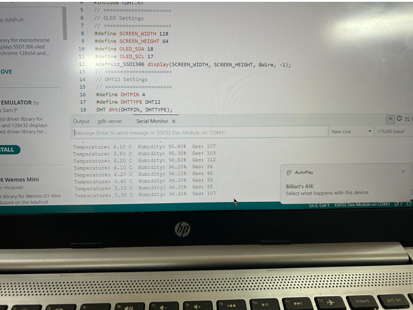

### Figure 2. Architecture A Simulation on Wokwi

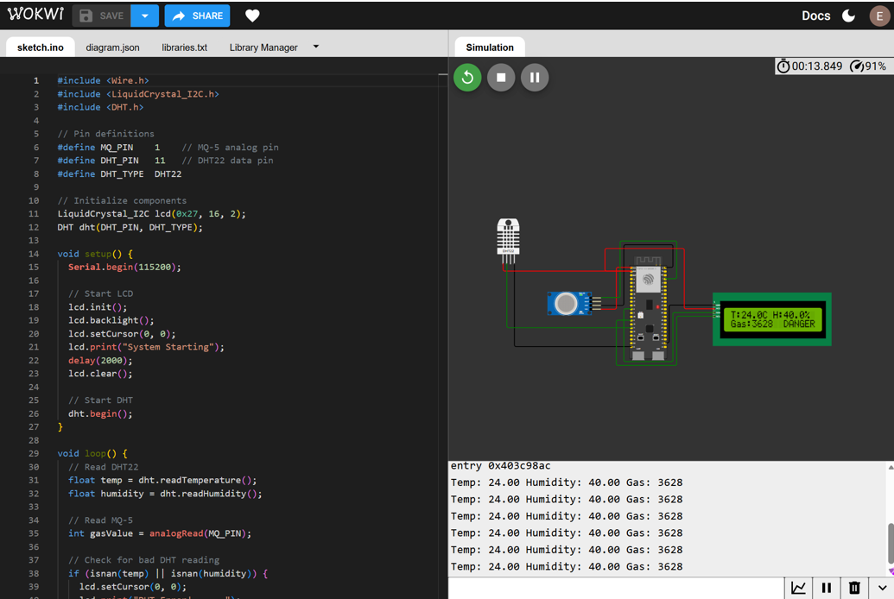

### Figure 3. Architecture A Physical Connection

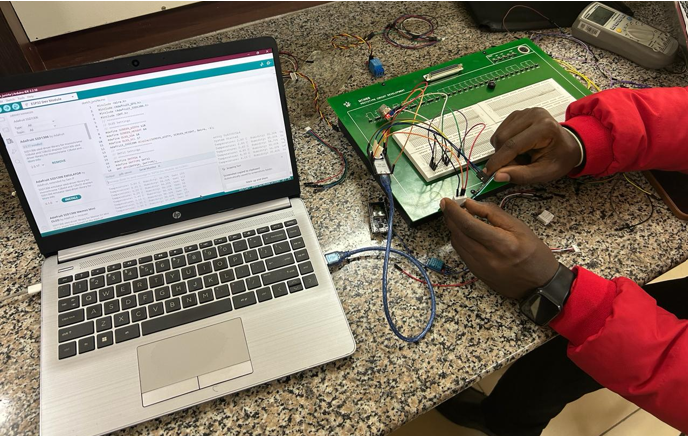

### Figure 4. Architecture A Output

---

## Appendix B – Physical Prototype Photographs

### Figure 5. Architecture B DHT22 Physical Input Connection

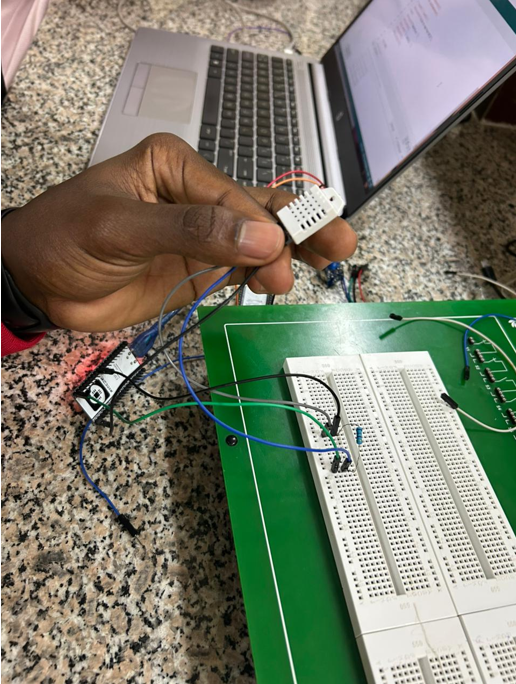

### Figure 6. Architecture B MQ-5 Physical Input Connection

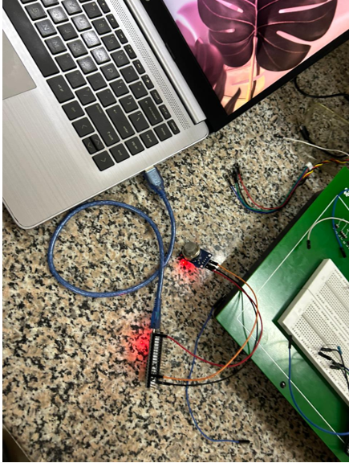

### Figure 7. Architecture B DHT22 Output

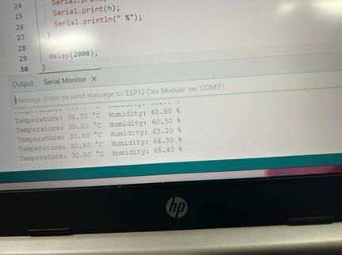

### Figure 8. Architecture B MQ-5 Sensor Output

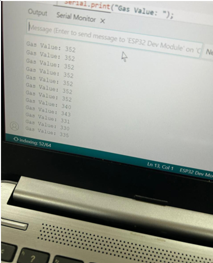

---

## Appendix C – Architecture C Wokwi Simulations

### Figure 9. Architecture C ESP32 Node 1

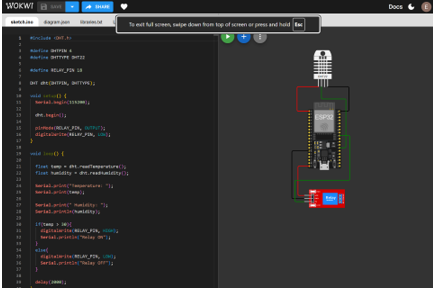

### Figure 10. Architecture C ESP32 Node 2

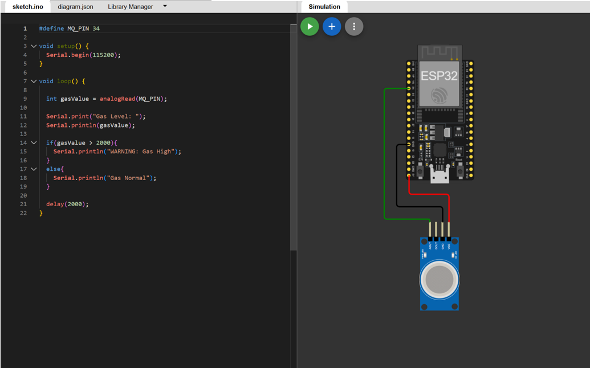

---

## Appendix D – Additional Laboratory Photos

### Figure 11. Architecture A

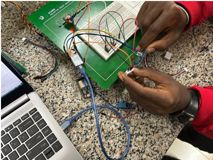

### Figure 12. Architecture B Schematics

### Figure 13. Architecture B Initial Connection (Failed Due to TX/RX Connection)

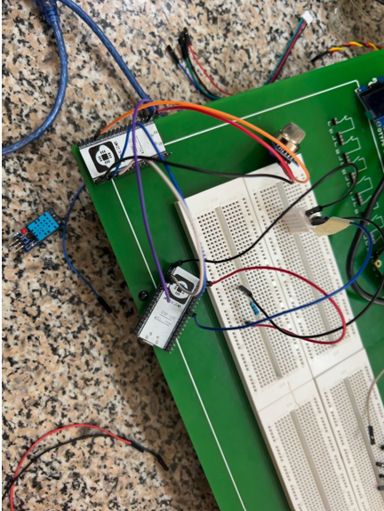

### Figure 14. Architecture B Error: The Two ESP32s Failed to Establish a Connection

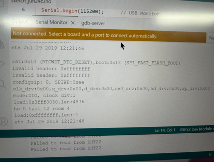

### Figure 15. Architecture B DHT22 Newer Connection with Connected Resistor

---

## Appendix E – Group Photo

### Figure 16. Group Photo

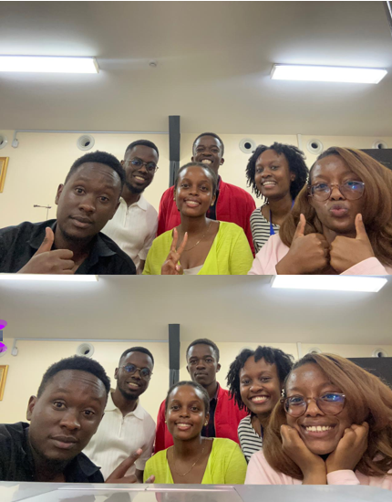
