# ICS 4111: Embedded Systems & IoT Semester Project

## Deliverable 3: Transmitting and Visualising Sensor Data on Cloud Platforms

**Group Name:** Circuitbreakers

**Group Members:**

| Name                       | Admission No. |
|----------------------------|---------------|
| Ngugi Elijah               | 146412        |
| Kanyi Sharon Wambui        | 153486        |
| Mwangi Billiart B. Muthoni | 164099        |
| Macharia Grace Wairimu     | 165899        |
| Samson Aira                | 166456        |
| Kevin Renana               | 168377        |

**Date:** 13th July 2026

---

## 1. Objective

To design an IoT-based environmental monitoring prototype that collects and transmits environmental sensor data (temperature, humidity, and gas concentration) from an ESP32 microcontroller to a cloud-based time-series database (InfluxDB Cloud) and visualises the collected data on a Grafana dashboard.

### Specific Objectives

1. Interface an ESP32 with a DHT22 (temperature/humidity), an MQ-5 (gas), and a 16×2 LCD.
2. Transmit sensor readings over Wi-Fi to InfluxDB Cloud at regular intervals.
3. Store all readings in a time-series database (InfluxDB Cloud) with device and location tags.
4. Build a Grafana dashboard with at least three visualisations of the collected data.
5. Provide local real-time feedback on the LCD, including sensor readings, upload status, and a warning message when gas concentration exceeds the defined thresholds.

## 2. Device Architecture

The environmental monitoring system is built around an ESP32 microcontroller, which acts as the central processing and communication unit. The ESP32 interfaces with a DHT22 sensor to measure temperature and humidity, an MQ-5 gas sensor to detect gas concentration, and a 16×2 LCD for displaying real-time sensor readings and system status locally.

The ESP32 reads the connected sensors every 2 seconds and displays the latest readings on the LCD. If the gas concentration exceeds the predefined thresholds, the LCD displays a WARN or DANGER alert. Every 10 seconds, the ESP32 transmits the current readings to InfluxDB Cloud using its integrated Wi-Fi module, and the LCD briefly confirms each successful upload.

The readings are stored in InfluxDB Cloud as time-series data. Grafana is connected to InfluxDB as the data source and retrieves the stored measurements to generate real-time visualisations for monitoring environmental conditions.

### System Components

The prototype consists of the following components:

| Component      | Role                                                                                                        | Interface    | ESP32 Connection                       |
|----------------|-----------------------------------------------------------------------------------------------------------  |--------------|----------------------------------------|
| ESP32          | Main microcontroller; reads sensors, drives the LCD, and transmits data to the cloud over Wi-Fi             | Wi-Fi        | —                                      |
| DHT22          | Measures ambient temperature (°C) and relative humidity (%)                                                 | Digital      | GPIO 11 (data)                         |
| MQ-5           | Detects combustible gas concentration (LPG, natural gas)                                                    | Analog (ADC) | GPIO 1 (analog out)                    |
| LCD 16×2       | Displays live readings, upload status, and SAFE / WARN / DANGER alerts based on the gas level               | Parallel/I²C | Parallel (physical) / I²C (simulation) |


### System Data Flow

The system operates as follows:

1. The DHT22 measures temperature and humidity.
2. The MQ-5 measures gas concentration.
3. The ESP32 processes the sensor readings.
4. The latest readings and gas alert status are displayed on the LCD.
5. The ESP32 transmits the readings to InfluxDB Cloud over Wi-Fi and confirms the upload on the LCD.
6. Grafana retrieves the stored data from InfluxDB to generate real-time visualisations.

### 2.1 Physical Prototype (Primary Implementation)

The prototype was implemented in the laboratory using an ESP32 DevKit mounted on a breadboard and wired to the DHT22 sensor, MQ-5 gas sensor, and a 16×2 LCD.

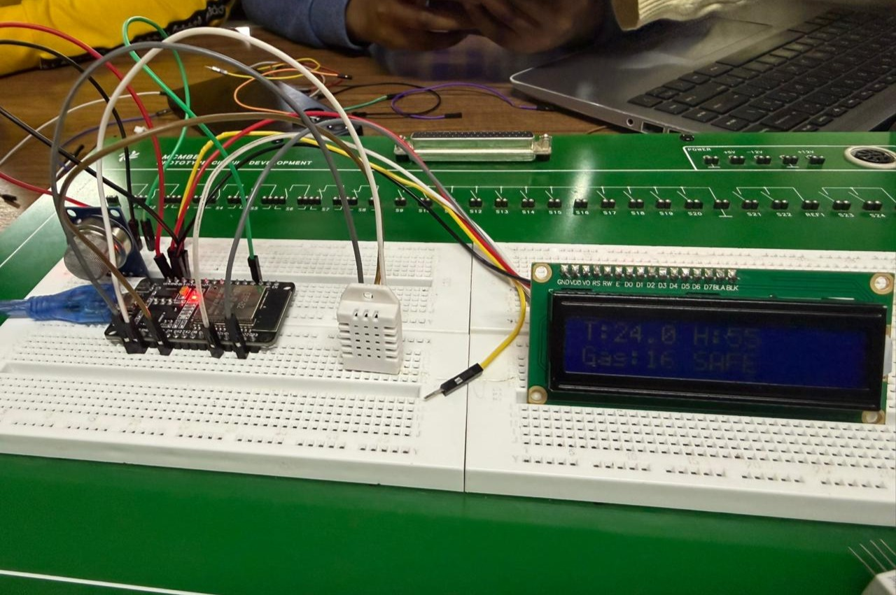

*Figure 1: Physical prototype in operation. The LCD displays live readings T: 24.0°C, H: 55%, Gas: 16 (SAFE).*

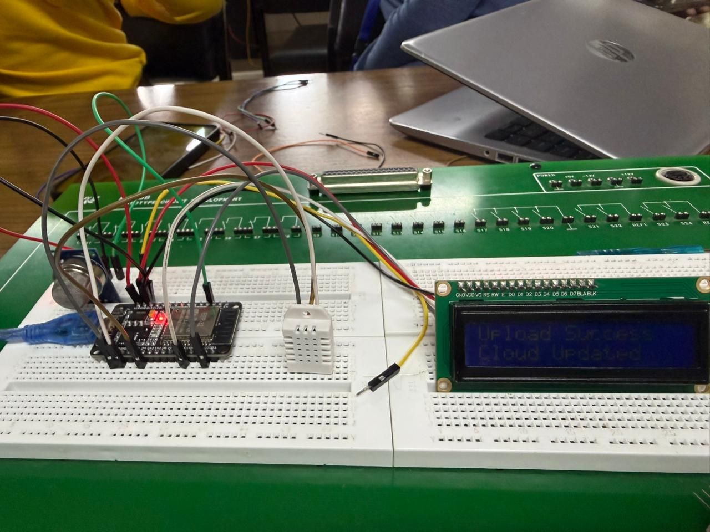

*Figure 2: The LCD displaying "Upload Success Cloud Updated", confirming the successful transmission of sensor readings to InfluxDB Cloud over Wi-Fi.*

### 2.2 Wokwi Simulation

The same system and firmware were also validated on Wokwi, which additionally allowed extended cloud data collection outside the laboratory.

**Public Wokwi project link:** [Wokwi Implementation](https://wokwi.com/projects/466916139619181569)

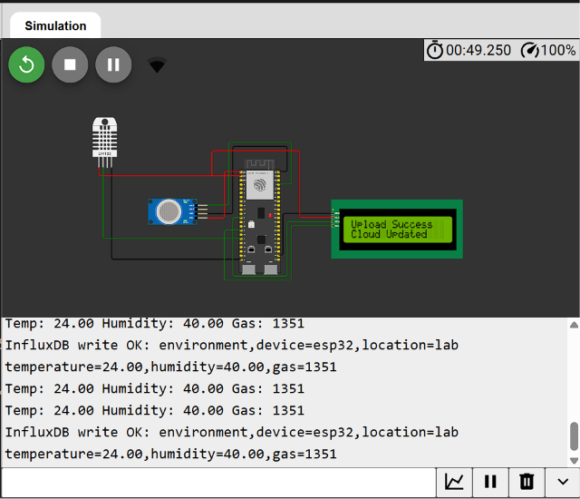

*Figure 3: Wokwi simulation running. The LCD confirms a successful cloud upload ("Upload Success Cloud Updated") while the serial monitor shows the corresponding InfluxDB write with the transmitted values.*

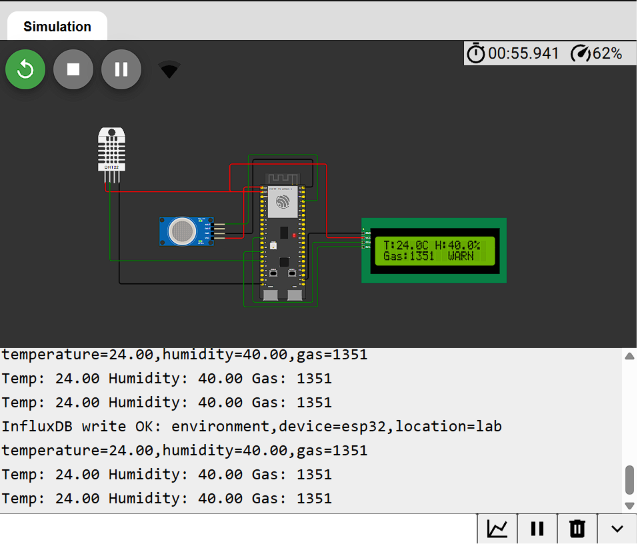

*Figure 4: The simulated LCD displaying live readings (T: 24.0°C, H: 40.0%, Gas: 1351) with the WARN alert triggered by the gas threshold logic.*

## 3. Firmware Logic

The ESP32 firmware is responsible for acquiring sensor data, displaying the readings locally, monitoring gas concentration, and transmitting the collected data to InfluxDB Cloud for storage and visualisation.

The full source code is available in: [`sketch.ino`](sketch.ino)

Security note: the InfluxDB API token is not stored in this repository. It is kept in a local `secrets.h` file which is excluded via `.gitignore`; a template is provided as [`secrets_example.h`](secrets_example.h). 

### Firmware Workflow

The firmware performs the following operations:

1. **System Initialization**
   - Initializes the serial monitor for debugging.
   - Configures the DHT22 sensor, MQ-5 sensor, and 16×2 LCD.
   - Connects the ESP32 to the configured Wi-Fi network.

2. **Sensor Data Acquisition**
   - The ESP32 reads the temperature, humidity, and gas concentration every 2 seconds.
   - It validates the DHT22 readings before further processing and reports a sensor error on the LCD if a reading fails.

3. **Local Display**
   - The latest temperature, humidity, and gas readings are displayed on the LCD.
   - The gas concentration is compared against two thresholds: SAFE (≤ 1000), WARN (> 1000), and DANGER (> 2500).
   - The corresponding alert status is shown alongside the gas reading.

4. **Cloud Data Transmission**
   - Every 10 seconds (`SEND_INTERVAL_MS = 10000`), the firmware packages the current readings into an InfluxDB line protocol record.
   - The record is uploaded to InfluxDB Cloud over Wi-Fi using HTTPS.
   - The LCD briefly displays "Upload Success / Cloud Updated" on a successful write, or an upload failure message otherwise.

5. **Continuous Monitoring**
   - The sensing and display cycle repeats every 2 seconds, with cloud synchronisation every 10 seconds, providing continuous environmental monitoring.

The firmware operates as a continuous control loop, periodically collecting sensor data, updating the LCD, evaluating gas levels against the configured thresholds, and synchronising the latest readings with InfluxDB Cloud.

---

## 4. Cloud Data Storage (InfluxDB)

InfluxDB Cloud was used as the time-series database for storing the environmental sensor data collected by the ESP32. The database stores timestamped measurements of temperature, humidity, and gas concentration, allowing historical sensor readings to be queried and visualised in Grafana.

Sensor readings are uploaded every 10 seconds using the InfluxDB HTTP Write API over a secure HTTPS connection. Each uploaded record contains a measurement name, associated tags, and sensor fields. InfluxDB automatically assigns a timestamp to each record when it is written to the database.

### Database Configuration

| Parameter               | Value                            |
|-------------------------|----------------------------------|
| Cloud Platform          | InfluxDB Cloud                   |
| Bucket                  | `iot_project`                    |
| Measurement             | `environment`                    |
| Fields                  | `temperature`, `humidity`, `gas` |
| Tags                    | `device=esp32`, `location=lab`   |
| Upload Interval         | Every 10 seconds                 |
| Communication Protocol  | HTTPS (InfluxDB HTTP Write API)  |

### Data Format

The ESP32 formats each sensor reading using the InfluxDB Line Protocol before transmitting it to the database.

```text
environment,device=esp32,location=lab temperature=<temperature>,humidity=<humidity>,gas=<gas>
```

where:

- Measurement: `environment`
- Tags: `device=esp32`, `location=lab`
- Fields: `temperature`, `humidity`, `gas`
- Timestamp: Automatically generated by InfluxDB Cloud

### Stored Data

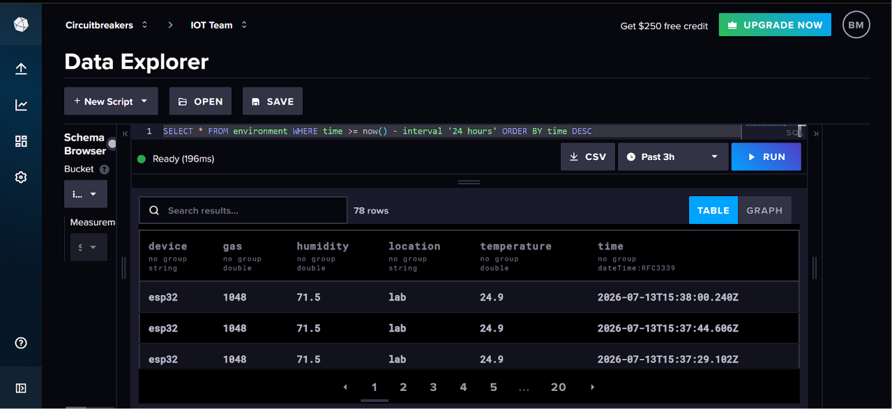

*Figure 5: InfluxDB Cloud Data Explorer showing the stored time-series data. The query returns rows containing `device`, `gas`, `humidity`, `location`, `temperature`, and `time` columns, confirming successful storage of all three sensor readings.*

---

## 5. Data Visualisation (Grafana)

Grafana was used to visualise the sensor data stored in InfluxDB Cloud. The dashboard was connected to InfluxDB as its data source, allowing real-time and historical sensor readings to be monitored through interactive charts.

The dashboard was configured to query the `environment` measurement from the `iot_project` bucket and display the collected temperature, humidity, and gas concentration measurements.


### Dashboard Visualisations

The Grafana dashboard includes the following visualisations:

| Visualisation                 | Description                                                                     |
|-------------------------------|---------------------------------------------------------------------------------|
| Temperature Time Series       | Displays changes in ambient temperature over time.                              |
| Humidity Time Series          | Displays changes in relative humidity over time.                                |
| Humidity Gauge                | Displays the current relative humidity as a gauge.                              |
| Gas Concentration Time Series | Displays MQ-5 readings over time with WARN and DANGER threshold lines.          |
| Gas Concentration Gauge       | Displays the current gas level with colour-coded SAFE / WARN / DANGER zones.    |

### Dashboard Features

The dashboard provides:

- Real-time monitoring of sensor measurements (10-second auto-refresh).
- Historical visualization of environmental data.
- Automatic updates as new readings are uploaded to InfluxDB Cloud.
- Interactive time-range selection for analysing trends.
- Threshold indicators matching the firmware's SAFE / WARN / DANGER gas alert levels.

### Dashboard Screenshots

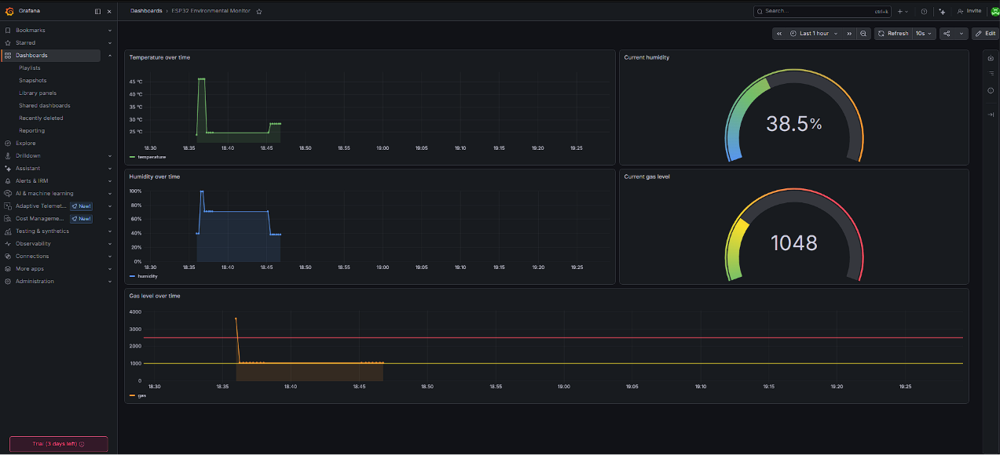

*Figure 6: The complete Grafana dashboard showing all five visualisations of the stored sensor data.*

#### Temperature

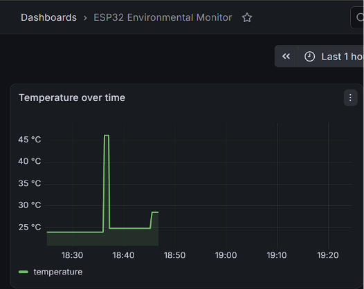

*Figure 7: Temperature readings over time.*

#### Humidity

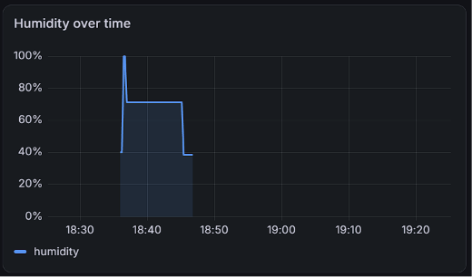

*Figure 8: Humidity readings over time.*

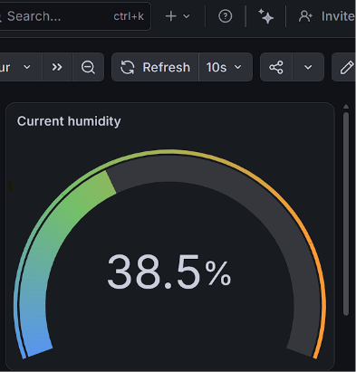

*Figure 9: Current humidity gauge.*

#### Gas Concentration

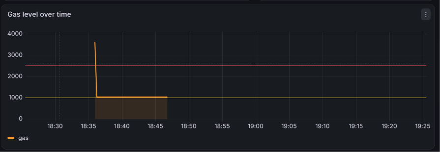

*Figure 10: Gas concentration readings over time with WARN and DANGER threshold lines.*

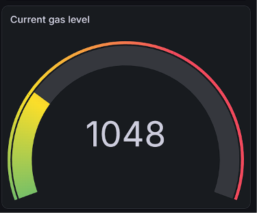

*Figure 11: Current gas level gauge with colour-coded SAFE / WARN / DANGER zones.*

## 6. Results and Observations

The developed IoT environmental monitoring system successfully collected temperature, humidity, and gas concentration readings using the DHT22 and MQ-5 sensors. The ESP32 displayed the measurements locally on the 16×2 LCD while transmitting the data to InfluxDB Cloud every 10 seconds over a Wi-Fi connection.

The uploaded sensor data was successfully stored as timestamped records in InfluxDB Cloud and retrieved by Grafana for visualization. The dashboard updated automatically as new measurements were received, enabling real-time monitoring of environmental conditions.

The gas monitoring functionality operated as expected. The LCD displayed SAFE, WARN, or DANGER messages depending on the measured gas concentration, and confirmed each successful cloud upload, providing immediate feedback to the user.

### Observations

- Wi-Fi connectivity was required for successful cloud uploads; upload failures are reported on the LCD.
- Sensor readings were updated locally every 2 seconds, while cloud uploads occurred every 10 seconds.
- InfluxDB automatically timestamped each uploaded record, allowing historical data to be visualized in Grafana.
- Grafana displayed the stored sensor data with minimal delay after upload.
- The physical prototype and the Wokwi simulation produced consistent behaviour, confirming that the firmware functioned correctly in both environments.

## 7. Conclusion

The project demonstrated an end-to-end IoT environmental monitoring system using an ESP32, DHT22 sensor, MQ-5 gas sensor, and a 16×2 LCD. Sensor readings were collected, displayed locally, transmitted securely to InfluxDB Cloud, stored as time-series data, and visualized through a Grafana dashboard.

## 8. Evidence of Groupwork


*Figure 12: Group members collaborating on the physical prototype.*


*Figure 13: Group members collaborating on the physical prototype.*

---

## 9. Repository Contents

```
├── DELIVERABLE_3.md        # This document
├── sketch.ino              # ESP32 firmware
├── secrets_example.h       # Template for the InfluxDB token (copy to secrets.h)
├── .gitignore              # Excludes secrets.h from the repository
├── diagram.json            # Wokwi circuit definition
├── libraries.txt           # Required Arduino libraries
├── grafana_dashboard.json  # Grafana dashboard definition (importable)
└── images/                 # Screenshots and groupwork evidence
```
